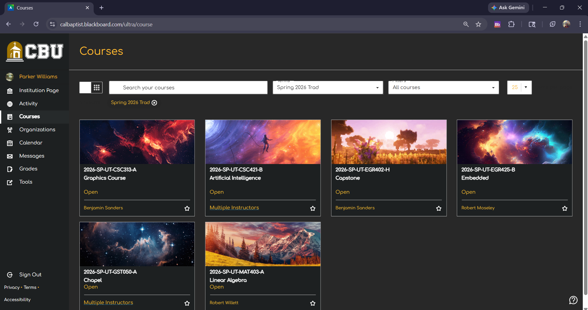

# Better Blackboard Learn

<p>
  
  
</p>

An Updated Look and Feel to Blackboard Learn. Providing Full User Customization, including Dark Mode, Course Customization, &  More!



### Supported on

<p><a rel="noreferrer noopener" href="https://chromewebstore.google.com/detail/better-blackboard-learn/ngmpmjpigceaccddpkoeejmakahopopa"></a></p>

## Inquiries

To contact me, please email parkerwilliams1500@gmail.com, or you can open an issue within the "Issues" tab on GitHub.

## Features
- Dark Mode
- Custom Course Images  
- Custom Course Names  
- Preset Themes
- Full Theme Customization (Primary, Secondary, and Sidebar colors)
- Custom Fonts

## Installation

To install, run, and build with this repository,

- Clone the repository locally with

```bash
  git clone https://github.com/ParkerWilliams1/BetterBlackboardLearn.git
```

- Visit `chrome://extensions` in your browser.
- Enable developer mode by toggling the switch in the upper right corner of the viewport.
- Click the "Load upacked" button in the header.
- When prompted to open a file, select the root directory of this repository.

## File Structure

```
.
├── README.md
├── content
│   └── content.js
├── icons
│   ├── BbOrangeGradient128.png
│   ├── BbOrangeGradient48.png
│   └── BbOrangeGradient16.png
├── options
│   ├── background.js
│   ├── options.html
│   └── options.css
├── popup
│   ├── popup.html
│   ├── popup.css
│   └── popup.js
└── manifest.json
```

## Contributing
If you find a bug or have a feature request, feel free to open an issue.
Pull requests are welcome.

## Contact
Email: parkerwilliams1500@gmail.com

## Branding


